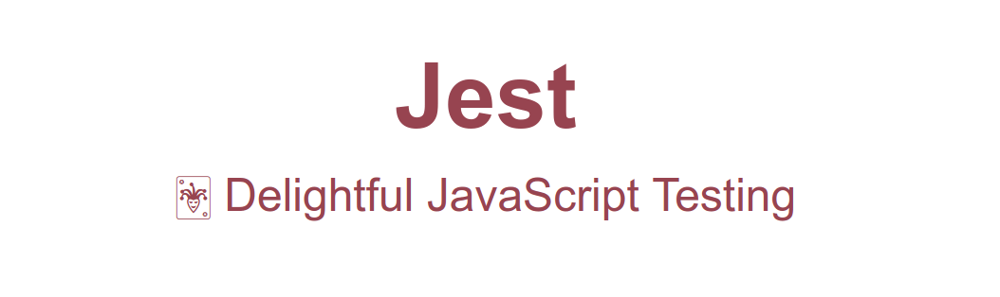
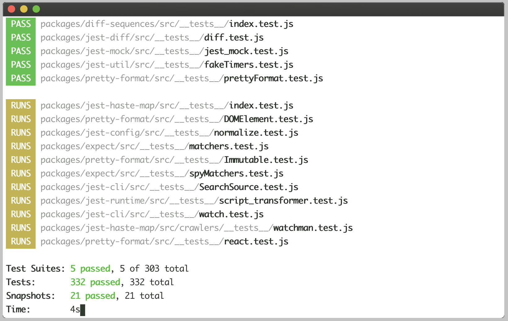

# Jest - Before getting started

https://jestjs.io/docs/en/getting-started

Add

    yarn add --dev jest

Install

    yarn i
    npm i

Run

    yarn run test
    npm run test

Result

    > @ test /home/flavio/Documentos/code-node/jest-before-getting-started
    > jest

    PASS  ./using-matchers.test.js
    PASS  ./sum.test.js

    Test Suites: 2 passed, 2 total
    Tests:       12 passed, 12 total
    Snapshots:   0 total
    Time:        1.419s
    Ran all test suites.

